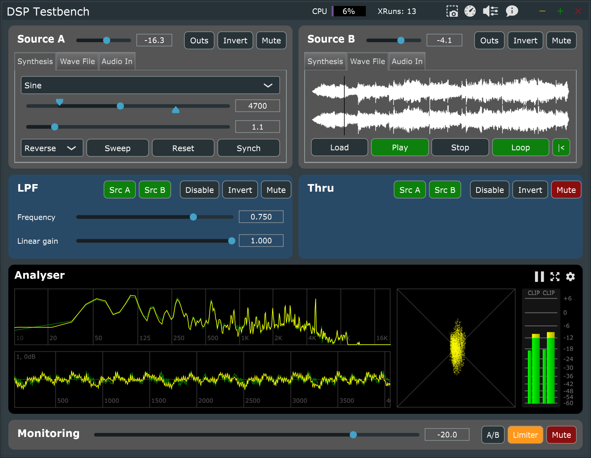

# DSP Testbench

DSP Testbench is designed to help developers using the [JUCE framework](https://juce.com) to analyse their DSP by providing a test harness for code inheriting from `juce::dsp::ProcessorBase`. The harness provides signal sources, routing, analysis and monitoring functions.

## Features

### Title Bar Controls

Besides the usual window sizing buttons, the title bar hosts the following controls:

- CPU meter
- Snapshot
- Performance benchmarks
- Audio device settings
- About (you already know what this does :) )

Most of the application settings are automatically saved and restored each time you restart the app.

### Signal Sources

Two individual signal source modules generate synthesised signals, play back audio files, or pass through from an audio interface. The synthesis tab provides periodic waveforms with sweepable frequencies, as well as impulse & step functions and noise generators. Each source can be muted, inverted or gain trimmed, and the periodic waveforms can be synchronised between the two source modules.

The triangle, square and saw oscillators are implemented with a PolyBLEP implementation to reduce aliasing, however it will still be visible in the analyser at higher frequencies.

Note that white and pink noise show up as a circle on the phase scope because we generate different samples on each channel. The other oscillators generate the same samples on each channel.

### Processor Control

Each of the two processor modules are used to host and control your DSP code. Either or both signal sources can be routed to each processor; and the output can be inverted, or muted.

One use case is to verify that code optimisations do not alter the output. You can achieve this by hosting different versions of your DSP code in either module, routing the same audio to both, and inverting the output of one processor to ensure perfect cancellation.

### Analysis

The analyser provides the following:

- FFT scope with logarithmic frequency scale (0 to -80dB amplitude scale)
- Oscilloscope
- Phase scope
- Level meter with VU (narrow) and peak (wide) meters for each channel
- Clip indicators (click to popup clip stats window with reset button)
- Pause button to freeze the display (audio is not paused)
- Expand button
- Advanced settings for scopes

The oscilloscope can be zoomed using the mouse wheel (hold shift to zoom amplitude instead of time) and you can pan by clicking and dragging. Double click anywhere on the oscilloscope to reset scale

### Monitoring

The monitoring section has a gain control and mute button to control the output level of the application. An optional output limiter is also provided to prevent digital overs (this is applied after the processors so does not affect their behaviour).

### Snapshot

The snapshot functionality allows you to pass 4096 samples through the processor then pause the analysis and audio so you can forensically examine the resulting output. Normal operation can be resumed by toggling the snapshot button again. When a snapshot is triggered, the audio device is stopped and restarted and all modules are reset so that the same 4096 samples will be generated and processed every single time. The only exception to this is if the wave file player has its' right hand button disabled, in which case playback will be from the current position.

### Performance Benchmarks

The benchmark functionality starts your processor(s) on another thread and pumps audio through, gathering statistics on how much time has been spent running your routines. A single block of audio is repeated from source A (using live audio input will not work).

## Developer Notes

To make use of DSP Testbench, you need to include your own code, wrap it appropriately and build the project.

- Navigate to the `Source\Processing` folder and take a look at `ProcessorExamples.h/.cpp`
  - This shows how to inherit from ProcessorHarness and shows examples of how to override the necessary pure virtual functions
- Create a local branch of the repository before proceeding
- Copy (or create) your own code into the project folder
  - Make sure you add these files to the Projucer project also
  - Either extend `ProcessorExamples.h/cpp` or create your own wrapper class and include it in `MainComponent.cpp`
- Instantiate your processor harness in the `MainContentComponent` constructor
  - If optimising code, then use two separate wrappers and instantiate them separately
- Build, run and test!

## Credits & Attributions

ASIO Interface Technology by Steinberg Media Technologies GmbH

This software makes use of certain code libraries, those portions of code are copyright as per below:

- JUCE 6 - copyright © 2020 Raw Material Software
- Application code - copyright © 2021 Oblique Audio
- Fast maths approximations - copyright © 2011 Paul Mineiro
- rand31pmc white noise generator - copyright © 2005 Robin Whittle
- Pink noise filter - Paul Kellett
- PolyBLEP/BLAMP - adapted from Tebjan Halm (vvvv.org)
- MGA JS Limiter - copyright © 2008 Michael Gruhn

## Software Disclaimer

This software is provided "as is" and you use it at your own risk.

The developers make no warranties as to performance, merchantability, fitness for a particular purpose, or any other warranties whether expressed or implied. No oral or written communication from or information provided by the developers shall create a warranty.

Under no circumstances shall the developers or contributors be liable for direct, indirect, special, incidental, or consequential damages resulting from the use, misuse, or inability to use this software, even if the developers have been advised of the possibility of such damages.

These exclusions and limitations may not apply in all jurisdictions. You may have additional rights and some of these limitations may not apply to you.

